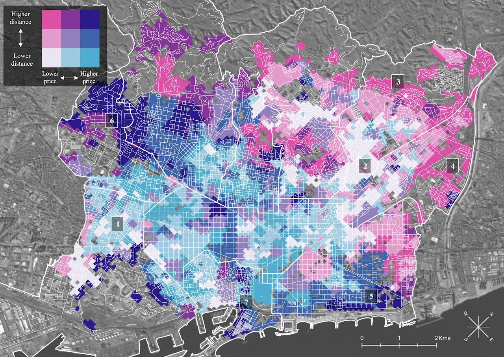
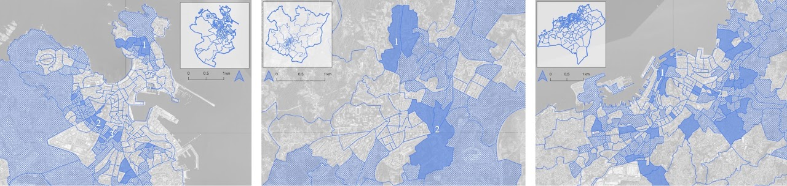
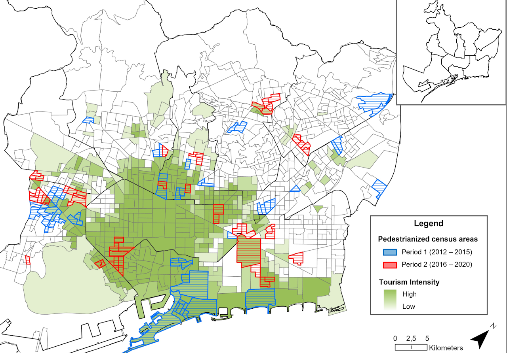
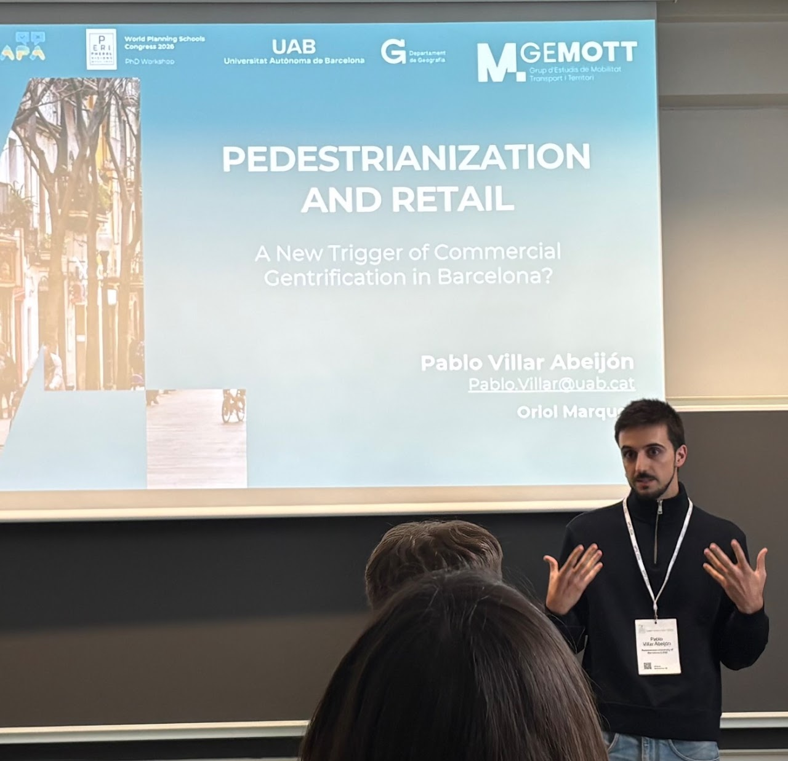

```{=html}
<header class="page-hero home-hero"><h1>Pablo Villar-Abeijón</h1></header>
```

::: {.site-content}

::: {.site-row .about-row}

::: {.site-column style="flex: 5;"}

## About me

{.site-image}

[E-mail me!](mailto:Pablo.Villar@uab.cat){.email-button}

:::

::: {.site-column style="flex: 7;"}

Born in Santiago de Compostela (Galicia, Spain), I\'m a [**final-year PhD candidate in Geography**]{.mark} at the Universitat Autònoma de Barcelona, where I\'m part of the [GEMOTT](https://gemott-uab.cat/en/) research group. I am currently supported by a [Joan Oró predoctoral fellowship]{.mark} awarded by the Generalitat de Catalunya.

My research explores the [relationship between built-environment transformations and gentrification processes]{.mark}. In particular, my PhD examines how pedestrianization, Superblocks, and other sustainable mobility interventions have affected neighbourhood change in Barcelona, with a focus on demographic shifts, commercial activity, and the housing market.

I\'m also interested in sustainable mobility policies and the factors that shape residents\' acceptance (or rejection) of urban interventions.

More broadly, I\'m motivated by understanding [how cities can advance environmental sustainability while promoting social justice]{.mark}, and how urban policies can contribute to both goals simultaneously. 

[My work is primarily quantitative and spatial]{.mark}, drawing on quasi-experimental methods (difference-in-differences and propensity score matching), spatial analysis (bivariate mapping, spatial regressions, and spatial autocorrelation) and applied econometrics.

When not doing research, I enjoy my time exploring cities on foot, playing the cello and going for a run just as an excuse to listen to music. 

[**Find out more about my research here!**](research-lines.qmd)

:::

:::

::: {.site-row}

::: {.site-column style="flex: 7;"}

```{=html}
<div class="map-carousel" aria-label="Research maps">
<figure class="carousel-slide"><figcaption>Proximity to amenities and renting prices in Barcelona</figcaption></figure>
<figure class="carousel-slide" hidden><figcaption>Gentrification in A Coruña, Santiago de Compostela and Vigo</figcaption></figure>
<figure class="carousel-slide" hidden><figcaption>Pedestrianized areas and touristic areas in Barcelona</figcaption></figure>
<div class="carousel-controls"><button type="button" data-prev aria-label="Previous map">‹</button><span data-counter aria-live="polite">1 / 3</span><button type="button" data-next aria-label="Next map">›</button></div>
</div>
```

:::

::: {.site-column style="flex: 5;"}

{.site-image}

Presentation at the World Planning Schools Conference 2026

:::

:::

```{=html}
<div class="interactive-map"><iframe title="Interactive research map" src="https://flo.uri.sh/visualisation/29546828/embed" loading="lazy" allowfullscreen></iframe></div>
```

:::
