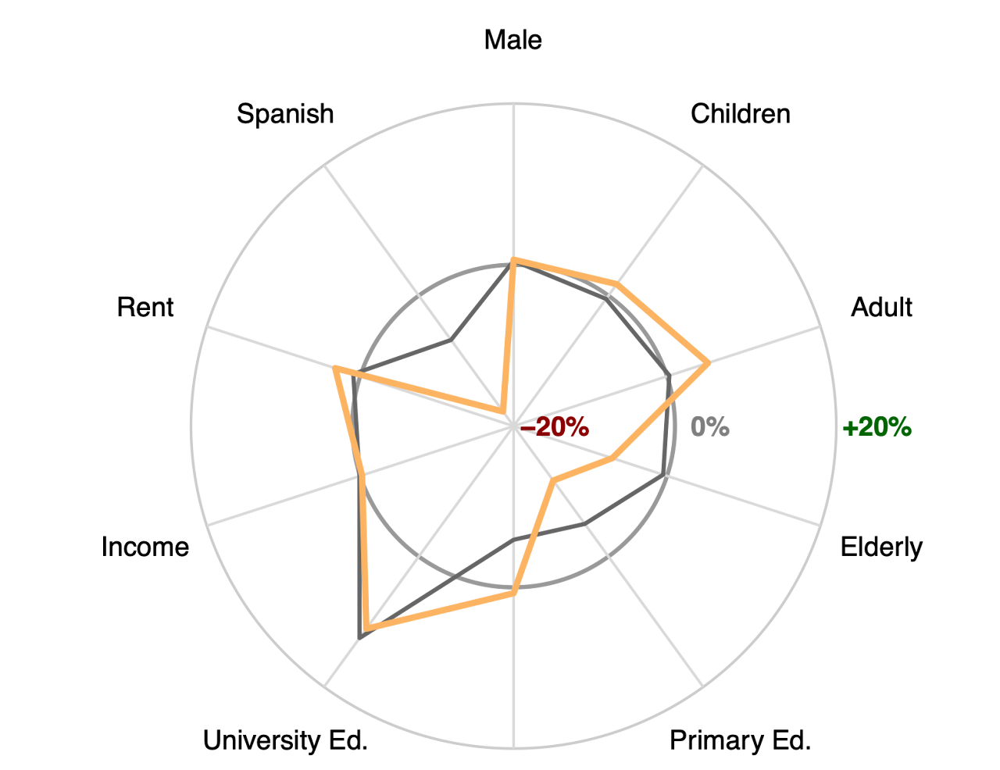
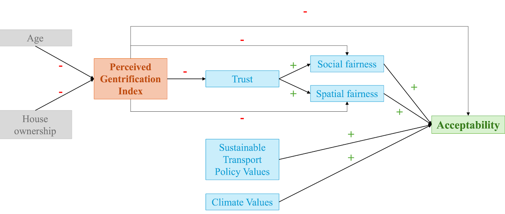

```{=html}
<header class="page-hero inner-hero"><h1>Research lines</h1></header>
```

::: {.site-content}

## **1. How Do Sustainable Mobility Interventions Reshape Neighbourhoods?**

::: {.site-row}

::: {.site-column style="flex: 6;"}

{.site-image}

:::

::: {.site-column style="flex: 6;"}

[Can active-mobility policies trigger gentrification?]{.mark}

\

This research examines the impacts of pedestrianized streeets and Superblocks on residential composition, commercial activity and housing markets using quasi-experimental methods. By identifying both the intended and unintended consequences of these interventions, it contributes to the design of urban policies that advance environmental sustainability while minimising displacement and social inequalities.

**Related papers: **

[Can pedestrianization trigger gentrification? Analysis of Barcelona's sociodemographic changes following pedestrianization schemes](https://doi.org/10.1016/j.trd.2025.104718)

[The effects of pedestrianization on commercial dynamics a quasi-experimental study in Barcelona](https://doi.org/10.1016/j.apgeog.2026.103947)

\

:::

:::

---

## **2.** **The 15-Minute** **City and** **Housing** **Prices**

::: {.site-row}

::: {.site-column style="flex: 6;"}

[Can cities become more accessible without becoming less affordable?]{.mark}

\

This research explores how proximity to everyday amenities shapes housing markets within the 15-minute city framework. By combining spatial analysis with econometric modelling, it examines whether accessibility premiums vary across neighbourhoods and cities, providing insights into how urban planning can improve access to services while supporting more equitable housing outcomes.

**Related papers: **

[The impact of proximity to amenities on housing affordability: Insights from Mediterranean 15-minute cities.](https://doi.org/10.1016/j.cities.2026.106859)

:::

::: {.site-column style="flex: 6;"}

{.site-image}

:::

:::

---

## **3. Objective Gentrification vs. Perceived Gentrification**

::: {.site-row}

::: {.site-column style="flex: 5;"}

{.site-image}

:::

::: {.site-column style="flex: 7;"}

[How do residents perceive gentrification? ]{.mark}

[Do these perceptions reflect measurable neighbourhood change? ]{.mark}

\

By combining census change indicators with survey data, we explore the relationship between objective and perceived gentrification, providing a more comprehensive understanding of how urban transformation is experienced. The high correlation between both types of measurements points at their complementarity.

**Related papers: **

[Perceived vs. objective gentrification: Bridging measurements of neighborhood change](https://doi.org/10.1080/07352166.2026.2638887).

:::

:::

---

## **4. Do Fears of Gentrification Shape Support for Superblocks?**

::: {.site-row}

::: {.site-column style="flex: 6;"}

[Why do sustainable urban interventions sometimes face opposition, even among environmentally minded residents? ]{.mark}

This research explores whether concerns about neighbourhood change and perceived gentrification shape public support for pedestrianisation, Superblocks and other sustainable mobility policies. By examining the social and political dimensions of urban transformation, it seeks to identify how cities can implement climate policies that are not only environmentally effective but also socially legitimate and broadly supported.

:::

::: {.site-column style="flex: 6;"}

{.site-image}

:::

:::

---

## **5.** **Measuring** **Gentrification** **in** **Mid-size** **Cities**

{.site-image}

[Measuring gentrification beyond global cities]{.mark}

Gentrification research has largely focused on major metropolitan areas, while smaller and medium-sized cities have received comparatively less attention. This research adapts quantitative approaches to identify and measure gentrification dynamics in less-studied urban contexts, using the main cities in Galicia (A Coruña, Santiago de Compostela and Vigo) as a case study. By combining socioeconomic indicators with spatial analysis, it reveals different patterns of neighbourhood transformation, including state-led gentrification, studentification and touristification.

:::
